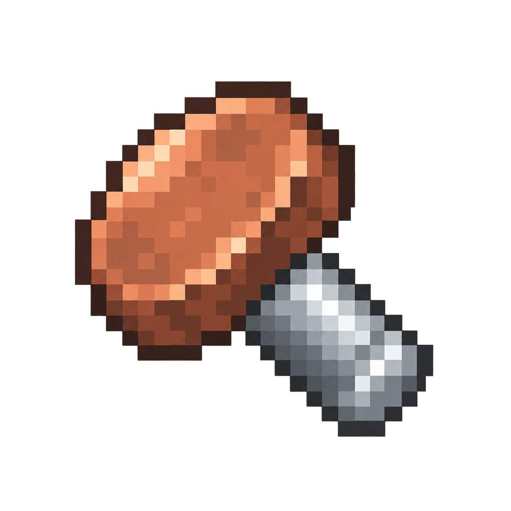

<p align="center">
  
</p>
<h1 align="center">Rivet</h1>
<p align="center">Сборка сервера, сообщество и задачи — внутри Minecraft.</p>
<p align="center">
  <a href="https://github.com/abrosdaniel/rivet/releases/latest">Скачать</a> ·
  <a href="template/README.md">Семя сборки</a> ·
  <a href="SERVER_GUIDE.md">Серверный справочник</a> ·
  <a href="https://github.com/abrosdaniel/rivet/issues">Сообщить о проблеме</a>
</p>

Rivet — мод для Minecraft с NeoForge. Он устанавливает и обновляет клиентскую сборку сервера, объединяет серверные события и задачи в одном меню и показывает краткую информацию во время игры.

Менеджер сборок работает на клиенте самостоятельно. Профили, объединения, задачи, модерация и вход через Rivet требуют установки мода на сервере. Эти возможности входят в один мод; отдельно устанавливать «модули Rivet» не нужно.

## Совместимость

| Компонент  | Требование                                               |
| :--------- | :------------------------------------------------------- |
| Minecraft  | 1.21.1                                                   |
| Java       | 21                                                       |
| NeoForge   | От 21.1.250 в ветке 21.1                                 |
| PostgreSQL | Обязательна для серверной части, включая работу без Auth |

В семени указывается **точная версия NeoForge** для сборки. Rivet сверяет её при установке и подключении. Диапазон загрузчика самого Rivet не отменяет требований остальных модов сборки.

## Возможности

- **Сборки:** обязательные и выбираемые компоненты, зависимости, зеркала загрузки, проверка SHA-256 и общий кэш файлов.
- **Сообщество:** профили игроков, объявления, объединения, события, голосования и предложения.
- **Задачи:** личные задачи и задачи объединений с этапами, сроками, ответственными, комментариями и ресурсами.
- **Информация во время игры:** настраиваемый виджет сервера и игрока, уведомления и напоминания о событиях.
- **Оформление:** светлые и цветные темы, поиск настроек, редактор HUD; библиотека и быстрая смена скинов.
- **Чат и TAB:** каналы рядом, общий и объединений, метаданные LuckPerms, головы игроков, кликабельные координаты.
- **Навигация:** временный маршрут к месту или координатам из чата, с меткой на карте при наличии Xaero’s.
- **Администрирование:** обращения игроков, объявления, обслуживание сервера, журнал действий и диагностика.
- **Аккаунты:** регистрация и вход по паролю, привязка официального Minecraft-аккаунта и управление сохранёнными устройствами.

## Начало работы

### Для игроков

1. Установите Minecraft 1.21.1, Java 21 и подходящий NeoForge через лаунчер.
2. Скачайте JAR из [релиза Rivet](https://github.com/abrosdaniel/rivet/releases/latest) и поместите его в `mods/` игровой папки.
3. В главном меню откройте **Rivet** и добавьте ссылку на публичный репозиторий семени сервера либо выберите сервер из каталога.
4. Откройте сборку, выберите необязательные компоненты и установите файлы. Обязательные компоненты устанавливаются всегда.
5. Перезапустите игру, если Rivet предложит это, и нажмите **«Подключиться»**.

На сервере меню открывается **F8** или командой `/rivet`, быстрая смена скина — **F7**. Клавиши можно переназначить в управлении Minecraft. **Esc** закрывает меню, **Backspace** возвращает на предыдущую страницу; при вводе текста Backspace удаляет символы.

При первом запуске Rivet устанавливает масштаб GUI 3. В дальнейшем выбранный игроком масштаб сохраняется. Виджет включён по умолчанию: его можно переместить, отключить и выбрать отображаемые блоки. Настройки общие для всех серверов.

### Для владельцев серверов

Установите JAR в `mods/` сервера и настройте PostgreSQL в созданном `config/rivet-server.toml`. Для распространения клиентской сборки используйте отдельный репозиторий семени.

- [Установка сервера, настройки, права и обновление](SERVER_GUIDE.md)
- [Создание и публикация семени сборки](template/README.md)

## Меню сервера

| Раздел            | Назначение                                                         |
| :---------------- | :----------------------------------------------------------------- |
| Главная           | Сводка, закреплённое объявление, ближайшие события и задачи        |
| Игроки            | Поиск игроков, профили, статистика и последняя активность          |
| Мои задачи        | Личные задачи; задачи объединения доступны внутри объединения      |
| Доска объявлений  | Публикации, покупка, продажа и обмен                               |
| Объединения       | Участники, заявки, общие задачи и места                            |
| События           | Встречи, запись, очередь участников и напоминания                  |
| Голосования       | Решения сообщества и разрешённые сервером голосования о нарушениях |
| Предложения       | Идеи игроков и обсуждение                                          |
| Сервер            | Информация о сервере                                               |
| Помощь            | Текст помощи и ссылки владельца сервера                            |
| Администрирование | Сводка и инструменты для игроков с соответствующими правами        |

Доступные разделы определяет сервер. Уведомления открываются из шапки меню. Личные сообщения используют чат Minecraft; отдельного мессенджера Rivet нет.

### Ресурсы и склады задач

Для задачи можно указать предметы и требуемое количество, затем привязать контейнер табличкой с тремя строками:

```text
&rivet
Название объединения или ник владельца личной задачи
Код задачи, например 7K2P
```

Код задачи остаётся прежним при переименовании. Привязку выполняет владелец личной задачи или управляющий объединения. Rivet учитывает содержимое загруженных контейнеров; для выгруженных показывает последнее подтверждённое состояние и время проверки, без дополнительной прогрузки чанков.

## Чат

Если сервер использует чат Rivet, сообщения пишутся в обычной строке чата Minecraft:

| Ввод                | Кому отправится сообщение                                  |
| :------------------ | :--------------------------------------------------------- |
| `привет`            | Игрокам рядом; если локальный канал выключен — в общий чат |
| `!привет`           | В общий чат                                                |
| `#Название: привет` | Участникам указанного объединения                          |

При вводе `#` появляется стандартный список подсказок Minecraft с доступными объединениями: ↑↓ выбирают, Tab вставляет название. Если вы состоите только в одном объединении, можно написать `#привет`.

`[pos]` вставляет ваши координаты: получатель может нажать на них и начать маршрут. Доступность каналов и координат определяет сервер.

Формат сообщения: **[канал] | голова префикс ник суффикс: текст**. Метка общего чата по умолчанию скрыта; у локального указано «Рядом», у объединения — его название. Префикс и суффикс приходят из LuckPerms, если он установлен на сервере.

Подсказку по вводу можно отключить и настроить в **Настройки Rivet → Чат**. Сервер включает или выключает чат Rivet целиком; отдельных режимов чата нет.

## TAB

TAB показывает список игроков с головами, метаданными LuckPerms и полосками качества связи. В **Настройки Rivet → TAB** доступны группировка по алфавиту, ролям или объединениям, головы, точный пинг, прозрачность, плотность строк и ширина колонок. Точный пинг по умолчанию выключен.

Сервер определяет, использовать оформление Rivet или стандартный TAB, и может разрешить автоматический выбор с учётом других модов. Игрок настраивает внешний вид доступного списка.

Для взаимодействия с TAB и виджетом назначьте клавишу **«Режим курсора»** в управлении Minecraft. Нажмите её при открытом TAB, чтобы выбрать игрока мышью. Повторное нажатие или Esc возвращает управление игрой. Большие списки прокручиваются колесом.

## Настройки и навигация

**Настройки Rivet** объединяют оформление, виджет, уведомления, TAB, чат и навигацию. Есть поиск параметров, светлые и цветные темы, предпросмотр. Настройки сохраняются автоматически; сброс затрагивает только выбранный раздел.

- Виджет можно отключить, выбрать его содержимое и переставить блоки перетаскиванием. Время сессии по умолчанию выключено.
- Редактор HUD находится внизу левой панели настроек. Он перемещает виджет, подсказку чата и указатель маршрута; R восстанавливает расположение, Esc завершает редактирование.
- Кнопка «Скины» открывает библиотеку. F7 используется для быстрой смены сохранённого скина.
- Координаты из чата и «Идти сюда» в карточке места создают один временный маршрут. Новый заменяет предыдущий; маршрут остаётся активным до прибытия или ручной остановки, без ограничения по времени. Он виден и при открытом чате. Чтобы остановить его, нажмите × на указателе в чате или режиме курсора.
- При наличии Xaero’s маршрут получает временную метку на карте. Сохранённые личные точки не изменяются. Без Xaero’s указатель работает самостоятельно.
- Голограмма привязанного хранилища показывает информацию вблизи, когда хранилище видно.

## Интеграции

Rivet автоматически подключает поддерживаемые установленные моды:

| Мод                         | Возможности                                                |
| :-------------------------- | :--------------------------------------------------------- |
| LuckPerms                   | Права, префиксы и суффиксы игроков                         |
| Plasmo Voice                | Голосовая модерация                                        |
| Xaero’s Minimap / World Map | Общие места, позиции участников и временные метки маршрута |
| Create: Access Denied       | Совместимость списков доступа с аккаунтами Rivet           |
| spark                       | Диагностика производительности для администрации           |

Эти моды устанавливаются отдельно. Для передачи своей позиции участникам объединения нужно согласие игрока; история позиций не сохраняется. Настройка и диагностика интеграций описаны в [серверном справочнике](SERVER_GUIDE.md#необязательные-интеграции).

## Обновления

На клиенте обновления Rivet доступны в главном меню; после установки нужен перезапуск игры. Сервер обновляет его владелец. Для новых функций может потребоваться обновление обеих сторон.

Версии имеют формат **A.B.C**: C — исправления, B — совместимые функции, A — несовместимые изменения. [Требования версии для сборки](template/README.md) и [обновление сервера](SERVER_GUIDE.md#обновление-и-резервные-копии) описаны отдельно.
